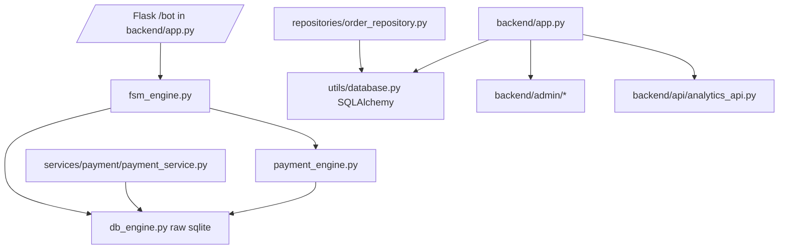
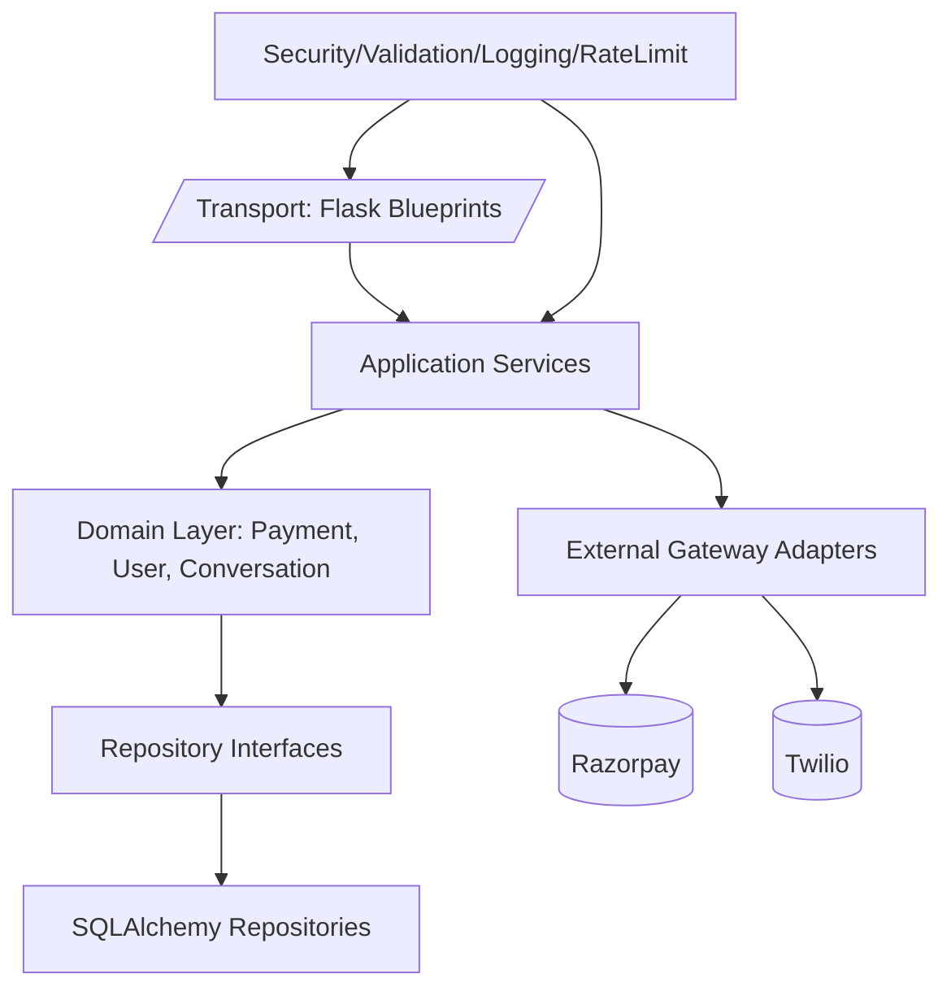

# Enterprise Code Audit & Refactoring Plan — Boloastro WhatsApp Bot

## Executive Summary

This codebase contains a mix of legacy and newer architectural styles (raw SQLite engine + SQLAlchemy repositories/services), resulting in inconsistent patterns, duplicated logic, and several production-critical reliability/security risks.

Top concerns:
- **P0 security**: hardcoded credentials and weak/no auth checks in admin and analytics endpoints.
- **P0 reliability**: payment flow contains likely runtime breakages (undefined client, mismatched fields, incompatible service/repository contracts).
- **P1 architecture debt**: multiple parallel database abstractions with partial migration but no bounded-context ownership.
- **P1 operational risk**: no effective automated test suite; `pytest` collection fails before tests run.

---

## Part 1: Critical Issues Report

### Priority Key
- **P0**: immediate production/security risk
- **P1**: high-impact reliability/architecture issue
- **P2**: medium impact maintainability/performance issue
- **P3**: low impact cleanup

| ID | Priority | Issue | Impact | Effort |
|---|---|---|---|---|
| C-001 | P0 | Hardcoded admin credentials/secrets | Account takeover, secret leakage | 2–4h |
| C-002 | P0 | Analytics auth is placeholder; effectively bypassable in dev, weak in prod | Unauthorized data exposure | 4–8h |
| C-003 | P0 | Payment engine references `razorpay_client` without visible initialization | Runtime failures on payment path | 2–6h |
| C-004 | P0 | Webhook service uses model fields/modules not aligned with current models | Failed payment capture flows | 1–2d |
| C-005 | P0 | Production webhook signature validation can be disabled/misconfigured by environment handling | Forged webhook/message risk | 4–8h |
| C-006 | P1 | `db_engine.py` has duplicated `get_conn` and unreachable connection configuration | Inconsistent DB behavior and hidden bugs | 3–6h |
| C-007 | P1 | Payment service retry depends on missing `phone` in fetched order payload | Retry flow failure | 2–4h |
| C-008 | P1 | Test collection fails due to executable `test_keys.py` side effects | No CI confidence | 2–6h |
| C-009 | P1 | Mixed data access stacks (raw SQL + SQLAlchemy repositories) | Tight coupling, migration risk | 2–4d |
| C-010 | P2 | In-memory rate limiter only (single process scope) | Ineffective abuse control in multi-instance deployment | 1–2d |
| C-011 | P2 | Monolithic files (`db_engine.py`, `fsm_engine.py`, `payment_engine.py`) | High change risk and onboarding overhead | 3–5d |
| C-012 | P2 | Duplicate/overlapping payment query logic across engines/services/repositories | Divergent behavior, bug duplication | 2–3d |

---

## Part 2: Code Duplication Analysis

## 2.1 Duplicate/overlapping payment data access

### Evidence
- Raw SQL in `backend/engines/payment_engine.py`
- Similar read/query logic in `backend/services/payment/payment_service.py`
- SQLAlchemy repository in `backend/repositories/order_repository.py`

### Refactoring
- Define a single source of truth: `OrderRepository` (SQLAlchemy) and gradually deprecate raw SQL reads.
- Introduce `PaymentGateway` adapter for Razorpay interactions and keep persistence out of gateway code.
- Remove duplicate read APIs from `payment_engine.py` once service/repository parity is complete.

## 2.2 Repeated API endpoint boilerplate (try/except + import + JSON envelope)

### Evidence
- `backend/api/analytics_api.py` repeats same structure across many endpoints.

### Refactoring
- Add `@analytics_endpoint` decorator handling: auth, error mapping, envelope.
- Keep handlers thin: parse input -> call service -> return data.

## 2.3 Duplicate/competing DB abstraction

### Evidence
- Legacy raw-SQL DB engine in `backend/engines/db_engine.py`
- New SQLAlchemy layer in `backend/utils/database.py` + models/repositories

### Refactoring
- Incremental strangler pattern:
  1. Freeze new features in `db_engine.py`
  2. Migrate read paths first to repositories
  3. Migrate write paths with transaction wrappers
  4. Remove dead SQL utilities

---

## Part 3: Architecture Redesign

## 3.1 Current Architecture (Observed)



Problems: parallel persistence stacks, blurred boundaries, domain logic in infra files.

## 3.2 Proposed Target Architecture



## 3.3 File Restructuring Plan

Proposed layout:

```
backend/
  api/
    v1/
      webhook_routes.py
      analytics_routes.py
  application/
    payment_service.py
    conversation_service.py
  domain/
    payment/
      entities.py
      policies.py
      interfaces.py
  infrastructure/
    db/
      models/
      repositories/
      session.py
    gateways/
      razorpay_client.py
      twilio_client.py
  shared/
    security/
    logging/
    validation/
```

## 3.4 Dependency Rules

- `api -> application -> domain/interfaces -> infrastructure`
- Domain must not import Flask/Twilio/Razorpay directly.
- Infra never imports API routes.

---

## Part 4: Refactoring Roadmap

## Phase 1 (Week 1): Critical fixes
1. Remove hardcoded credentials and rotate exposed values.
2. Implement robust admin/analytics auth middleware.
3. Fix payment runtime blockers (`razorpay_client` initialization, field mismatches).
4. Enforce webhook signature validation in production with explicit fail-closed mode.
5. Stabilize tests: isolate `test_keys.py` from pytest collection.

## Phase 2 (Week 2–3): Architecture improvements
1. Create repository interfaces and bind payment flows to one stack.
2. Split `db_engine.py` by bounded contexts (users, sessions, payments, analytics).
3. Move webhook orchestration to application service with clear DTOs.
4. Centralize configuration and validation.

## Phase 3 (Week 4): Performance optimization
1. Add DB profiling and query metrics for hot endpoints.
2. Add Redis-backed rate limiter and idempotency cache.
3. Add response caching for non-volatile astro/reference calls.
4. Optimize indexes based on observed query plans.

## Phase 4 (Week 5–6): Testing & documentation
1. Add unit tests for services, repositories, validators.
2. Add integration tests for webhook/payment flows.
3. Add contract tests for Razorpay/Twilio adapters.
4. Add architecture decision records and runbooks.

---

## Part 5: Best Practices Guide

## Coding standards
- Enforce `ruff + black + isort + mypy` in CI.
- Ban side effects at module import time.
- Keep functions < 50 lines unless justified.

## Naming conventions
- `snake_case` for Python symbols, `PascalCase` for classes.
- Suffix interfaces with `Repository`/`Gateway`, implementations with `Sql...`/`Razorpay...`.

## Error handling patterns
- Map external errors to typed domain exceptions.
- Use centralized Flask error handlers (400/401/403/409/422/500).
- Avoid broad `except Exception` unless at boundaries with logging + context.

## Logging strategy
- Structured logs (`json`) with `request_id`, `user_phone_hash`, `order_id`, `event_id`.
- Never log secrets/tokens.
- Track retry counters and latency.

## Documentation requirements
- Each module includes purpose + ownership + invariants.
- API routes documented with request/response schemas.
- Runbook for payment webhook incident handling.

---

## Part 6: Actionable Fix List (with code)

## A-001 (P0) Hardcoded admin credentials
**File**: `backend/admin/admin_auth.py` (line ~30), `backend/admin/admin_config.py`.

### Current (problematic)
```python
ADMIN_PASSWORD = "boloastro123"
```

### Proposed fix
```python
# backend/admin/admin_auth.py
from werkzeug.security import check_password_hash
from backend.config import settings

ADMIN_PASSWORD_HASH = settings.ADMIN_PASSWORD_HASH

if request.method == "POST":
    submitted = request.form.get("password", "")
    if ADMIN_PASSWORD_HASH and check_password_hash(ADMIN_PASSWORD_HASH, submitted):
        session["admin"] = True
        return redirect("/admin/analytics")
```

### Migration/testing steps
1. Add `ADMIN_PASSWORD_HASH` to env.
2. Generate hash offline and rotate current password.
3. Add integration test for login success/failure.

## A-002 (P0) Weak analytics authentication
**File**: `backend/api/analytics_api.py`.

### Current
- TODO markers for auth validation.

### Proposed fix
```python
# backend/api/analytics_api.py
from hmac import compare_digest
from backend.config import settings

api_key = request.headers.get("X-API-Key", "")
if not settings.ANALYTICS_API_KEY or not compare_digest(api_key, settings.ANALYTICS_API_KEY):
    return jsonify({"error": "Unauthorized"}), 401
```

### Migration/testing steps
1. Add `ANALYTICS_API_KEY` secret.
2. Add tests for missing, invalid, valid keys.

## A-003 (P0) Undefined Razorpay client path
**File**: `backend/engines/payment_engine.py`.

### Current
- Uses `razorpay_client` but no guaranteed initialization.

### Proposed fix
```python
from functools import lru_cache

@lru_cache(maxsize=1)
def get_razorpay_client():
    if not Config.RAZORPAY_KEY_ID or not Config.RAZORPAY_KEY_SECRET:
        return None
    return razorpay.Client(auth=(Config.RAZORPAY_KEY_ID, Config.RAZORPAY_KEY_SECRET))

client = get_razorpay_client()
if client is None:
    raise RuntimeError("Razorpay credentials missing")
```

### Migration/testing steps
1. Add unit tests with monkeypatched credentials.
2. Validate startup health check fails-closed when payment required.

## A-004 (P0/P1) Webhook-service/model mismatch
**File**: `backend/services/webhook_service.py`, `backend/models/order.py`.

### Current
- References `order.user_id`, `order.razorpay_payment_id`, and `app.workers.*` paths not aligned to codebase.

### Proposed fix
```python
# Replace user_id with phone in service DTOs
self.entitlement_service.grant(
    user_id=order.phone,
    product_type=order.product_type,
    order_id=order.order_id,
    metadata={"event_id": event_id, "payment_id": payment_id}
)

# Use existing field
order.payment_id = payment_id
```

### Migration/testing steps
1. Add webhook integration test with `payment.captured` payload.
2. Assert idempotency by replaying same event.

## A-005 (P1) Duplicate `get_conn` and unreachable DB config
**File**: `backend/engines/db_engine.py`.

### Current
- Multiple `get_conn` definitions; unreachable WAL settings after early return.

### Proposed fix
```python
def get_conn():
    db_path = Config.DATABASE_URL.replace("sqlite:///", "")
    conn = sqlite3.connect(db_path, check_same_thread=False)
    conn.row_factory = sqlite3.Row
    conn.execute("PRAGMA journal_mode=WAL")
    return conn
```

### Migration/testing steps
1. Add smoke test for `get_conn()` and PRAGMA application.
2. Remove duplicate function and dead code.

## A-006 (P1) `pytest` blocked by side-effect script
**File**: `test_keys.py`.

### Current
- Calls `exit()` at import-time when env vars are absent.

### Proposed fix
```python
def main():
    ...

if __name__ == "__main__":
    main()
```

### Migration/testing steps
1. Rename to `scripts/check_keys.py` or guard under main.
2. Run `pytest` in CI.

## A-007 (P2) Distributed rate limiting
**File**: `backend/utils/rate_limiter.py`.

### Current
- In-memory `defaultdict(deque)` rate limiting only.

### Proposed fix
Use Redis sliding window or token bucket with Lua for atomicity.

### Migration/testing steps
1. Add Redis-backed limiter class.
2. Fall back to in-memory only in local dev.

---

## Additional findings by category

### Code quality and smells
- Monolithic modules with many responsibilities (`app.py`, `db_engine.py`, `payment_engine.py`).
- Broad catch-all exceptions in many endpoints and engines.
- Magic defaults for pricing and hardcoded literals in multiple modules.

### File structure issues
- Empty route files (`routes/user.py`, `routes/whatsapp_webhook.py`) suggest dead/unfinished structure.
- Legacy and new architecture coexist without clear ownership boundaries.

### Database issues
- Some tables miss explicit foreign keys (e.g., payment/user linkage modeled by raw phone text).
- Mixed transaction handling style (manual commit/close in many places, context manager in others).

### Security issues
- Hardcoded secrets and weak auth flows.
- Auth TODOs and environment-based bypasses.
- Secret-related logging needs review to avoid accidental leak.

### Performance issues
- Synchronous blocking network calls in request paths.
- No centralized caching strategy for repeated expensive operations.

### Testing gaps
- No stable unit/integration suite currently executable.
- Missing regression tests around webhook idempotency and payment retries.

---

## Recommended KPIs for refactor success
- P0 defects: 0 open by end of Week 1.
- Payment webhook success processing: >99.9%.
- Duplicate code in payment stack reduced by >60%.
- Test coverage: 70% service layer, 90% critical payment/webhook flows.
- Mean incident recovery time for payment failures reduced by 50%.
